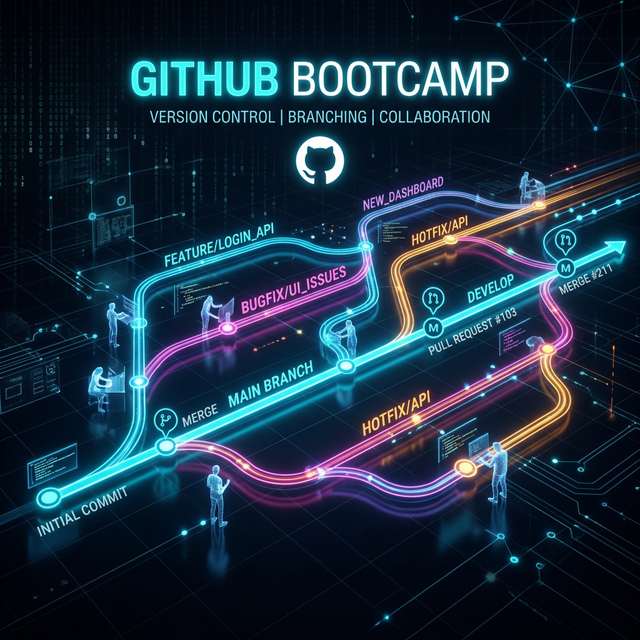

# Appendix C: GitHub Skills Bootcamp
**Self-Certification Criteria** (Skip if you can do ALL of the following):
*   Create a repo, branch, commit, push, and create a PR from the CLI.
*   Resolve a merge conflict.
*   Write a GitHub Actions CI workflow from scratch (YAML).
*   Use GitHub Projects with custom fields and automation.
*   Use the GitHub CLI (`gh`).

---

# Part 1: Git & GitHub Foundations

## The Git Mental Model
*   **Commits:** Snapshots of your codebase, not diffs.
*   **Branches:** Lightweight pointers to a specific commit.
*   **HEAD:** A pointer to the current branch/commit you are on.
*   **The Three Trees:** 
    1. Working Directory (what you see)
    2. Staging Area/Index (what's proposed for the next commit)
    3. Repository/History (what's saved)

*Practice Command:* `git log --oneline --graph --all`

---

# GitHub CLI (`gh`) & The GitHub Flow

## GitHub Flow
1. Create a feature branch off `main`.
2. Make changes and commit.
3. Push the branch to GitHub.
4. Create a Pull Request (PR) describing the changes.
5. Review, resolve conflicts, and merge (squash, rebase, or merge commit).

## Using the CLI
`gh auth login` -> `gh repo view` -> `gh pr create`

---

# Part 2: Actions & Projects

## GitHub Actions Fundamentals
CI/CD = Continuous Integration / Continuous Deployment.

**Workflow Anatomy:**
*   `on`: The trigger (push, pull_request, schedule).
*   `jobs`: Units of work that run in parallel by default.
*   `steps`: Individual commands or actions to execute.
*   `runners`: The virtual machine (e.g., `ubuntu-latest`).

*Never copy-paste YAML from StackOverflow blindly.*

---

# Projects & The Verification Checklist

## Projects
We use GitHub Projects to manage scope (Delivery & Process).
*   Columns: Backlog, This Week, In Progress, Review, Done.
*   Custom Fields: Module, Priority, Effort (Sizes).

## Your Verification Checklist
Before starting Day 1, an instructor must verify:
1.  You have a green CI pipeline.
2.  Your Projects board is seeded with issues for Module 1.
3.  Your `gh` CLI works.
4.  Branch protection is enabled on `main` (requires PR reviews).
