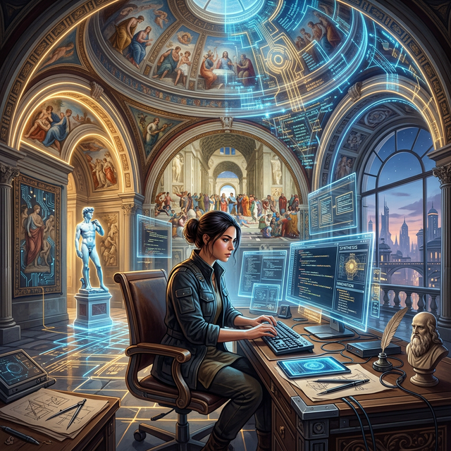

# Module 1: Foundations
## The Renaissance Developer & Your AI Toolkit
**Day 1: Concept & Vision**

---

# Welcome & Program Orientation
**Not just another bootcamp — we’re training a new archetype of engineer.**

* **10-Week Roadmap:** The arc from foundations to capstone.
* **The "Startup CTO" Metaphor:** You will bridge product building and business problems.
* **Daily Rhythm:** Briefings, sprints, Impossible Stuff Fridays.

---

# Cohort Introductions
Let's get to know each other.

1.  Name
2.  Background
3.  What is one thing you hope to build by Week 10?

---

# The Renaissance Developer Archetype (DNA)
## The Five Mindsets

1. **Curiosity (保持好奇):** Discover problems, don't just solve them.
2. **Outcome (结果导向):** Business impact > code shipped. 
3. **Polymath (博学思维):** Think like a business insider. Cross-disciplinary.
4. **Precision (精准沟通):** Spec-driven communication from C-suite to frontline.
5. **Systems (系统思考):** Connect technical systems with business processes. Create order from chaos.

---

# The Four Competency Layers
Building from individual execution to scale and strategy. 

* **Layer 1: Technical Foundation:** Cloud, Data Modeling, CI/CD, Lean Thinking.
* **Layer 2: Architect:** Architecture, Code Quality, SRE.
* **Layer 3: Enabler:** Pattern Generalization, Dev Experience, Tech Writing.
* **Layer 4: Strategist & Leader:** Business Immersion, Problem Discovery, Prototypes, Stakeholder Management.

---

# The AI Multiplier Model
## AI Generation $\rightarrow$ Human Verification $\rightarrow$ Business Value

*   **The Paradigm Shift:** AI changes the core competency from *writing code* to *architecting, validating, and integrating*.
*   **The Creative Director Metaphor:** You are the architect, AI is your construction crew.
*   **The Quality Gate:** Your job is to verify and review AI-generated code, ensuring it meets high standards.

---

# The Developer Manifesto
*Polymath at the center.*

1.  **Delivery**: Critical technical initiatives.
2.  **People**: Shaping talent strategy.
3.  **Business**: Technology-driven strategy.
4.  **AI**: Tool evaluation and workflow design.
5.  **Reliability**: SLOs/SLIs and resilient systems.
6.  **Process**: Efficiency and retrospectives.

**The Core Value: Creating clarity from chaos (在混沌中建立清晰).**

---

# Forward-Deployed Engineering
*Taking the startup CTO mindset to the enterprise.*

*   **Palantir FDE Model:** Engineers embedded directly with business units.
*   **Characteristics:** Small teams, end-to-end ownership, product engineering + customer engagement simultaneously.
*   **The Renaissance Developer is not theoretical:** OpenAI, Ramp, Shopify ("spiky generalists"), and Stripe hire for this right now.

---

# The Tool Landscape Overview

Our AI Toolkit for the next 10 weeks:

1.  **Claude Code CLI:** Terminal-native, Unix composable.
2.  **Kiro:** Spec-driven development (requirements -> design -> code).
3.  **Antigravity:** Agent orchestration, parallel agent execution.
4.  **OpenClaw Ecosystem:** Autonomous agents (our case study).
5.  **NotebookLM:** Curating your AI study companion.

---

# Day 1 Homework & Close

## Homework:
1. Ensure all AI tools are installed and working.
2. *GitHub Add-on Check*: Complete the GitHub Add-on tonight if you haven't!
3. Upload the *Renaissance Developer Role Summary* to your NotebookLM notebook.

## Reflection:
*“The thing that most surprised me about the Renaissance Developer concept is...”*
