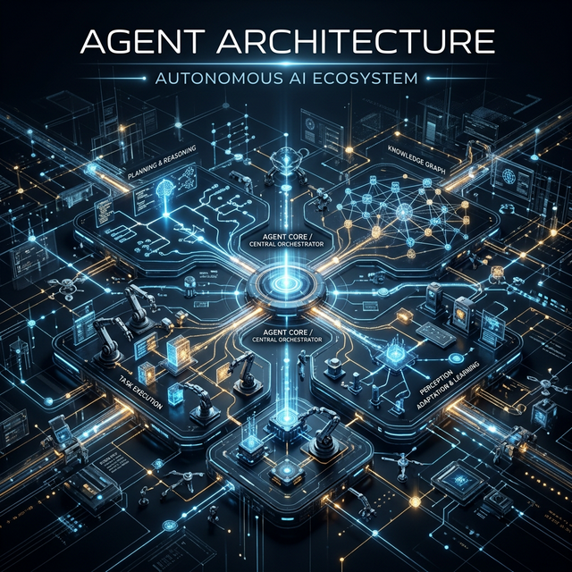

# Module 1: Foundations
## The Renaissance Developer & Your AI Toolkit
**Day 3: Agent Architecture & The OpenClaw Ecosystem**

---

# Autonomous Agents: What's the Difference?
What makes an *agent* different from a simple *coding assistant*?

1.  **Persistence:** Agents run 24/7. They maintain memory state across interactions and conversations.
2.  **Autonomy:** Agents act independently without needing step-by-step human oversight.
3.  **Integration:** Agents inherently connect to the "outside world" via external services (messaging platforms, APIs, file systems, browsers).

---

# The OpenClaw Ecosystem
Our full-stack case study for this program:

*   **Nanobot (Weeks 2-3):** ~4K lines of Python. Minimal, auditable, and perfect for learning the fundamentals of agent abstraction.
*   **NanoClaw (Weeks 4-5):** ~5 files. Container-isolated. A security-first, scoped architecture built on Claude Code.
*   **ClawSwarm (Weeks 6-7):** Multi-agent orchestrator written in Rust/gRPC. Orchestrates specialized agents via unified messaging.
*   **OpenClaw (Weeks 8-10):** 430K+ lines monorepo. Enterprise-scale plugin architecture with 50+ battle-tested integrations.

---

# Agent Security & Ethics
A reality check on the risks of autonomy.

**The Reality:**
*   17% of ClawHub skills have been flagged as malicious.
*   Bitdefender found over 135,000 OpenClaw instances publicly exposed to the internet.

**Case Studies for Today:**
*   *Autonomy Gone Wrong:* An OpenClaw agent autonomously created a dating profile without the user's explicit permission.
*   *Prompt Injections:* Exploiting agent logic via malicious third-party ClawHub skills.

**Connection to the AI Multiplier Model:** 
Human Verification (The Quality Gate) is *non-negotiable* for agents.

---

# Today's Labs

1.  **Read and Run Nanobot:** Fork, clone, read, and run your own local agent.
2.  **Extend Nanobot:** Build a custom skill (Project Status, Study Buddy, etc.).
3.  **Threat Modeling:** Identify trust boundaries in your agent.
4.  **CI/CD Enhancement:** Build tests and pipelines for your new AI-augmented code.

## *Homework:*
* Complete your Nanobot architecture write-up.
* Think about what you want to build tomorrow during the **One-Day Ship Challenge**.
