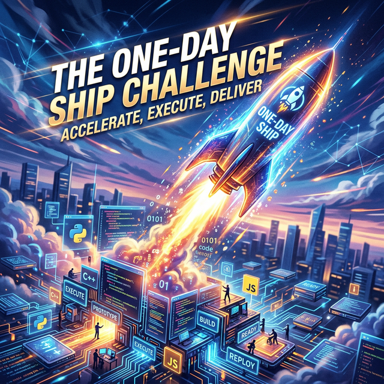

# Module 1: Foundations
## The Renaissance Developer & Your AI Toolkit
**Day 4: The One-Day Ship Challenge**

---

# The Challenge
Build, test, and deploy a working web application by 4:00 PM today.

This is the program’s first taste of the **"deliver in days not months"** mindset and the Rapid Prototyping competency.

## Constraints
* Use at least 2 AI tools.
* Implement CI/CD via GitHub Actions.
* The app must be deployed and accessible via a public URL.

## No Constraints
* Language, framework, cloud provider, or application type.

---

# Suggested Ideas

*Bring your own idea, or choose one of these:*
1.  **A personal dashboard:** Pull data from 2+ public APIs.
2.  **A career tool:** Solve a real problem you've encountered at work.
3.  **A SaaS prototype:** Landing page + one core feature + API.
4.  **An AI-powered tool:** Document analyzer, code reviewer, meeting summarizer.

---

# Success Criteria
1.  It works.
2.  It's deployed (URL).
3.  It has tests (minimum of 5).
4.  The CI/CD pipeline is **green**.

## Connection to the Renaissance Developer
This is the **Rapid Prototyping** and **Delivery** competency in action. 

---

# The Schedule Today

*   **09:30 - Architecture & Planning Sprint:** Plan before coding (the Precision mindset).
*   **10:00 - Build Sprint Block 1:** Heads-down building.
*   **11:00 - Pulse Check:** Who has a running backend?
*   **12:30 - Working Lunch**
*   **13:15 - Build Sprint Block 2:** Focus shifts to tests, CI/CD, and deployment.
*   **14:00 - Milestone:** Who has a green pipeline?
*   **15:15 - Lightning Demos:** 3 minutes each, strictly timed.
*   **16:15 - Retrospective**

---

# Lightning Demos format
Every student gets exactly 3 minutes (strictly timed).

1.  **What and why? (30 sec)** — Practice the Precision mindset.
2.  **Live demo at deployment URL (60 sec)** — Delivery in action.
3.  **Show GitHub (60 sec)** — Commit history, pipeline, Projects board (Process transparency).
4.  **One surprise from AI tools today (30 sec)** — Curiosity reflection.

*Peer voting to follow: "Most creative", "Most technically impressive", "Most likely to use daily."*
