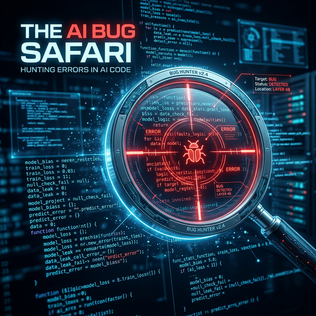

# Module 2: AI-Augmented Development
## Verification, Governance & the Quality Gate
**Day 2: The AI Bug Safari**

---

# Training Your Failure Detector

Yesterday we learned to generate code systematically. Today we learn how to break it systematically.

**Key Insight:** Reviewing AI output is often *harder* than writing the code yourself. AI code looks deceptively confident and syntactically correct, even when it is logically flawed.

---

# Why AI Fails: The Taxonomy

1.  **Confident Hallucination:** Invents APIs, variables, or features that don't exist.
2.  **Subtle Logic Errors:** Passes happy-path tests, but fails edge cases horribly.
3.  **Security Blind Spots:** SQL injections, missing auth, hardcoded secrets. 
4.  **Performance Anti-Patterns:** Code works, but is $O(n^2)$ instead of $O(n)$ or creates N+1 query problems.
5.  **Stale Knowledge:** Uses deprecated APIs or old paradigms (e.g., callbacks instead of async/await).
6.  **Copy Without Context:** Clones error handling or patterns from generic data without adapting to your specific architecture.

*(Industry Data: GitClear found a 4x growth in code duplication since AI coding tools became widespread).*

---

# The Verification Lens

Before accepting any AI generated block, ask:

1.  **Correctness:** Does this do exactly what I asked?
2.  **Edge Cases:** Does this safely handle what I *didn't* ask?
3.  **Security:** Would I be comfortable if this ran with real user data right now?
4.  **Performance:** Would I be comfortable if this ran with 10x traffic?
5.  **Maintainability:** Will someone else (or me) understand this in 6 months?

---

# Today: The Safari

1.  **Round 1 - Planted Bugs:** We have curated 10 code samples. Find the bugs.
2.  **Round 2 - Wild Bugs:** Use your tools to generate code for 4 complex tasks. Find the bugs in *your own* AI's output.
3.  **The AI Bug Log:** Document your findings. This is your personal reference moving forward.
