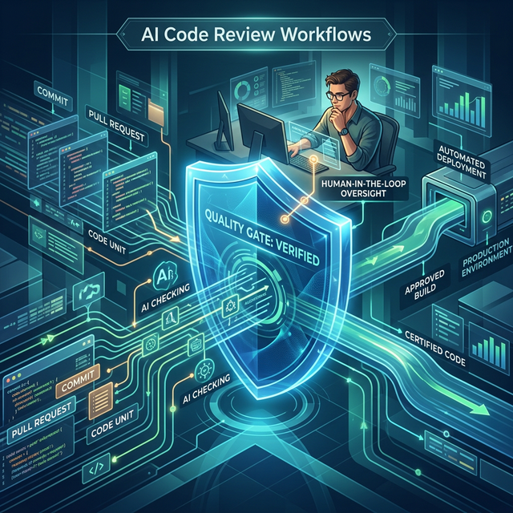

# Module 2: AI-Augmented Development
## Verification, Governance & the Quality Gate
**Day 3: AI Code Review Workflows**

---

# From Individual Intuition to Team Process

Spotting AI bugs personally is Level 1. Building a system where your team spots them consistently is Level 3.

**How code reviews change when 70%+ of code is AI-generated:**
1.  The reviewer must understand *intent*, not just implementation syntax.
2.  Test coverage becomes the primary verification tool, not an afterthought.
3.  "Did the AI solve the right problem?" is as important as "Is the code correct?"

---

# The AI Code Review Checklist

We need structured checklists embedded in PR templates. 
*(You will build your own today, extending these 6 sections)*

1.  **Intent Verification:** Does it solve the *actual* problem requested?
2.  **Correctness & Edge Cases:** Happy path vs Error path.
3.  **Security Scan:** Input validation, secrets, OWASP top 10.
4.  **Performance & Scalability:** Big-O complexity, N+1 queries.
5.  **Maintainability:** AI copy-paste vs project conventions.
6.  **Test Quality:** Do tests verify behavior, or just execute code to gain coverage?

---

# Automating Verification

**The best verification is automated.** Humans are for judgment; machines are for consistency.

Your CI/CD pipeline is your automated quality gate:
*   Linting and Code Complexity checks.
*   Security scanning (e.g., Bandit, npm audit).
*   Test coverage thresholds (block merge if < 80%).

*Connects to the JD: "Establish SLOs/SLIs across teams."*

---

# Today's Labs

1.  **Checklist Design:** Build a comprehensive, 6-section AI Code Review Checklist in Markdown.
2.  **Structured Code Review Practice:** Review 2 real, AI-generated Pull Requests using your new checklist. Leave actionable comments.
3.  **Workflow Design Workshop:** Design a complete end-to-end workflow for a team of 5 engineers using AI tools.
