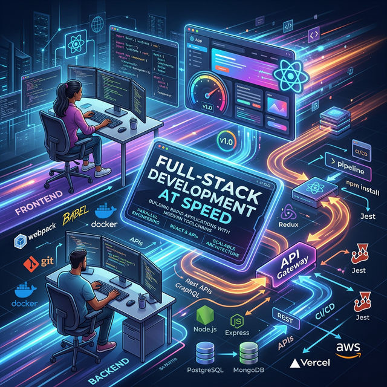

# 🚀 Module 3: Full-Stack Development at Speed
## Day 1: Full-Stack Speed Run (Part 1)
**Renaissance Developer Academy**

---

## Overview

1. **The Objective:** Ship a complete full-stack app in 1 week.
2. **Speed Run Pattern:** Zero to deployed in 2 days.
3. **Parallel Development:** Frontend and Backend simultaneously.
4. **Agentic Workflows:** Leveraging Antigravity's Manager View.

---

## 🏗 Full-Stack Architecture

A modern, scalable architecture involves defining boundaries early.

- **Frontend:** React (Vite / Next.js)
- **Backend:** Node.js (Express/Nest) or Python (FastAPI)
- **Database:** PostgreSQL
- **The Glue:** RESTful APIs or GraphQL

**Golden Rule:** Spec the API **FIRST**.

---

## ⚡ Parallelizing the Build

How do we build both sides simultaneously?

1. **Contract-Driven Development:** Establish the API specification (e.g., OpenAPI/Swagger) on Day 1.
2. **Mocking Data:** The frontend team (or agent) builds UI against mock endpoints.
3. **API Implementation:** The backend team (or agent) builds the real endpoints adhering exactly to the contract.
4. **Integration:** Snap them together in Part 2.

---

## 🤖 Antigravity Multi-Agent Workflow

Using the **Manager View** for maximum velocity:

- **Plan:** Define the system architecture and API contract.
- **Instruct:** Launch one subagent to scaffold the React frontend.
- **Instruct:** Launch another subagent to scaffold the API backend.
- **Verify:** The Manager reviews both results.

**Pro Tip:** Give each agent extremely clear, focused context. Do not let them step on each other's toes.

---

## 🛠 Today's Mission

**The Scaffold Lab**

1. Initialize the monorepo structure.
2. Scaffold the React application.
3. Scaffold the basic API server.
4. Define the API contract (JSON definition).

*Let's move fast and build things!*
