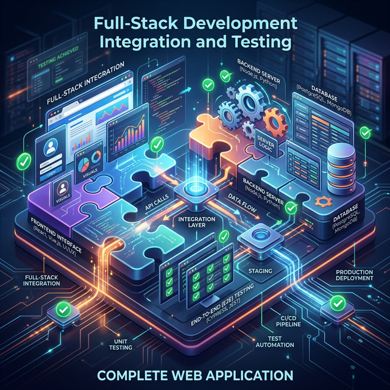

# 🚀 Module 3: Full-Stack Development at Speed
## Day 2: Full-Stack Speed Run (Part 2)
**Renaissance Developer Academy**

---

## Overview

1. **Integration:** Connect the React frontend to the real backend.
2. **CORS & Proxying:** Navigating local development hurdles.
3. **Database Hookup:** Replacing mocked data with Postgres.
4. **End-to-End Testing:** Ensuring the entire flow works.

---

## 🔗 The Integration Layer

The moment of truth is when the real Frontend API client speaks to the real Backend server.

- **Check 1:** Does the backend parse JSON correctly?
- **Check 2:** Does the backend return the exact schema defined in `contract.md`?
- **Check 3:** Are environment variables configured so the frontend knows where the backend lives?

---

## 🚧 CORS & Local Development

**Cross-Origin Resource Sharing (CORS)** is the #1 pain point in local dev.

- **Frontend:** `localhost:5173` (Vite)
- **Backend:** `localhost:3000` (Express)

**Solution:** Configure a proxy in `vite.config.ts`, or configure CORS middleware on the API server. 

---

## 🗄 Hooking up the Database

It's time to replace the static JSON files.

- Connect to Postgres locally or via Docker.
- Build your schema and seed it with dummy data.
- Update your repository layer to query the DB and map the results to the API Contract.

*We will do a deep dive into schemas tomorrow, but today, just get the data flowing!*

---

## 🧪 End-to-End Testing (E2E)

Unit tests prove your code works. E2E tests prove your *application* works.

- **Playwright / Cypress:** For browser automation.
- **The Golden Path Test:** Write one test that does the core user journey (e.g., Login -> Create Item -> View Item).
- **Rule of Thumb:** If the E2E test fails, the build fails.

---

## 🛠 Today's Mission

**Integration & E2E Testing Lab**

1. Replace API mock data with real database connections.
2. Connect the React frontend directly to the API server.
3. Resolve any CORS or routing errors.
4. Write a simple Playwright test validating the integration.

*Deliver a working full-stack prototype by the end of the day!*
