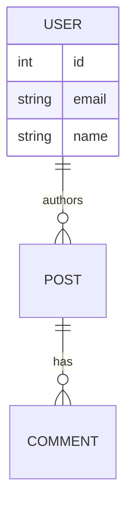

# Architecture Walkthrough: [Project Name]

> **Instructions:** Complete this document to describe the full-stack application you built during Module 3. Commit it to your repository wiki or `docs/` folder.

## 1. System Overview
**What does this application do?**
*Provide a 2-3 sentence summary of the business case and core functionality.*

## 2. Component Architecture
**Frontend:**
- Framework: [e.g., React/Vite]
- Routing: [e.g., React Router]
- State Management: [e.g., Context API, Redux, Zustand]

**Backend API:**
- Framework/Language: [e.g., Node.js/Express, Python/FastAPI]
- Key Endpoints:
  - `GET /api/v1/...`
  - `POST /api/v1/...`

**Data Layer:**
- Database: [e.g., PostgreSQL via Neon/Supabase]
- ORM/Migration Tool: [e.g., Prisma, Alembic]

## 3. Database Schema
*Provide a mermaid.js Entity Relationship Diagram (ERD) or a code block showing the core tables.*

## 4. CI/CD Pipeline
*Describe the GitHub Actions workflow.*
- **Linting & Testing:** [What runs on PR?]
- **Matrix Build Strategy:** [What versions/OS were tested?]
- **Artifact Generation:** [Where does the Docker image go?]
- **Deployment:** [How does it get to the cloud? Auto or manual?]

## 5. Deployment Topology
*Provide a diagram or text description of where components live in production.*

- **Client Application:** Hosted on [Provider]
- **API Server:** Hosted on [Provider], deployed via Docker.
- **Database:** Hosted on [Provider].

## 6. Known Trade-offs & Tech Debt
*What corners did you cut to finish in 5 days? What would you fix if you had 1 more month?*
- e.g., "We did not implement rate limiting on the API."
- e.g., "The frontend state management is slightly messy; we just prop-drilled."
