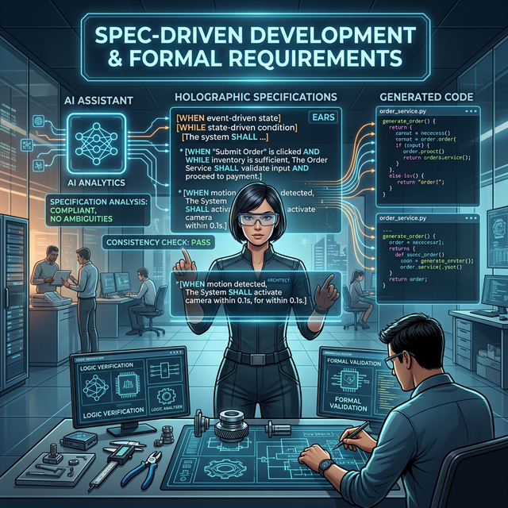

# 🏗 Module 4: System Design & Architecture
## Day 2: Kiro Spec-Driven Workflow & EARS Notation
**Renaissance Developer Academy**

---

## Overview

1. **The Cost of Ambiguity:** Why AI hallucinates bad architecture.
2. **Spec-Driven Development:** Reversing the modern workflow.
3. **EARS Notation:** Writing requirements machines understand.
4. **The Kiro Workflow:** Requirements -> Design -> Tasks -> Code.

---

## 🌫 The Cost of Ambiguity

*"Build a login page that looks good."*

- **Human Engineer:** Asks 15 clarifying questions.
- **AI Agent (Auto-mode):** Invents a random database schema, pulls in 4 bloated npm packages, and builds a feature that doesn't fit your system.

**If the spec is ambiguous, the AI's output is unpredictable.**
We must write formal requirements.

---

## 👂 EARS Notation

**E**asy **A**pproach to **R**equirements **S**yntax.

A framework for writing unambiguous natural language requirements.

1. **Ubiquitous:** The system shall `<action>`...
2. **Event-driven:** WHEN `<trigger>`, the system shall `<action>`...
3. **State-driven:** WHILE `<state>`, the system shall `<action>`...
4. **Unwanted behavior:** IF `<error>`, the system shall `<action>`...
5. **Optional feature:** WHERE `<feature is included>`, the system shall `<action>`...

---

## 📝 EARS Examples

**Bad:**
"The user should get an email when they buy something but only if they are logged in."

**EARS (State + Event):**
"WHILE a user is authenticated, WHEN an order is successfully processed, the system shall send an order confirmation email to the user."

*AI agents map EARS directly to unit tests and conditional logic.*

---

## 🤖 The Kiro Spec-Driven Workflow

Kiro is designed strictly for this process:

1. **`requirements.md`:** Write your EARS requirements.
2. **`design.md`:** Let Kiro propose the architecture and API contracts based *only* on the requirements.
3. **`tasks.md`:** Kiro breaks the design into a massive checklist.
4. **Execution:** You tell Kiro: "Execute Task 1." It writes the code and checks the box.

---

## 🛠 Today's Mission

**Spec-Driven Application Build**

1. Define a complex feature using EARS notation.
2. Use Kiro to generate the System Design.
3. Use Kiro to generate the Implementation Plan.
4. Execute the plan without touching the keyboard yourself.

*Code is a byproduct of a good specification.*
