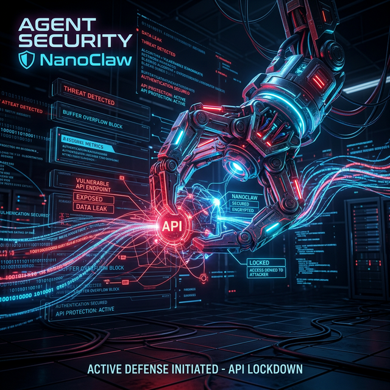

# 🏗 Module 4: System Design & Architecture
## Day 4: Containerized Agent Security & NanoClaw
**Renaissance Developer Academy**

---

<!-- Note: Cover image generation paused due to rate limits -->
## Overview

1. **The Danger of Agents:** AI writes code, but it also executes it.
2. **The Principle of Least Privilege:** Why Docker is non-negotiable.
3. **NanoClaw Architecture:** Stripped down, secured agents.
4. **Agent Security Audit:** Identifying attack vectors.

---

## ⚠️ The Danger of Autonomous Agents

If you give an AI agent access to your terminal to "fix a bug," it might decide to:
- Run `rm -rf /` because it hallucinated a cleanup script.
- Push your private API keys to a public GitHub repo.
- Download a malicious npm package.

**You cannot trust the LLM's reasoning engine to be secure.** You must trust the *sandbox* it runs inside.

---

## 📦 Sandboxing with Docker

Docker isn't just for deployment; it is a security boundary.

- **Isolation:** The agent cannot see your host machine's files.
- **Resource Limits:** You can prevent the agent from using more than 512MB of RAM.
- **Network Bridges:** You can block the agent from accessing the internet entirely (`--network none`), allowing it only to read local files.

*Never run an autonomous agent directly on your Macbook.*

---

## 🦀 Introducing NanoClaw

NanoClaw is a minimal, secured version of the OpenClaw agent architecture.

- Built in Rust/Go for memory safety and zero external dependencies.
- Runs exclusively inside a distroless Docker container.
- Its "Tools" (File Read, File Write, Bash execution) are heavily audited and restricted to a `/workspace` volume.

---

## 🛠 Today's Mission

**NanoClaw Security Lab**

1. Deploy the provided `NanoClaw` Docker image.
2. Review its Dockerfile. What liberties does it have? What is restricted?
3. Attempt to get the agent to read a file *outside* of its mounted volume. (Prompt Injection attack).
4. Write a brief Security Analysis report.
