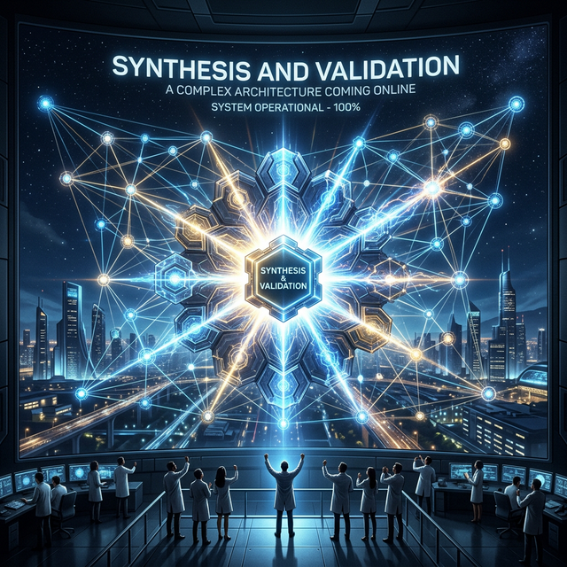

# 🏗 Module 4: System Design & Architecture
## Day 5: Systems Architect Synthesis & Validation
**Renaissance Developer Academy**

---

<!-- Note: Cover image generation paused due to rate limits -->
## Overview

1. **The Role of the Architect:** Synthesis over isolation.
2. **Reviewing the Week:** Specs, ADRs, and Security.
3. **The Capstone Architecture:** Defining your final project.
4. **Validating the Design:** Peer reviews and pressure testing.

---

## 🧭 Synthesis Over Isolation

An architect doesn't just draw boxes and arrows; they synthesize competing priorities.

- **Product wants:** Infinite features, zero latency.
- **Engineering wants:** 100% test coverage, perfect abstractions.
- **Security wants:** Zero remote access, air-gapped systems.
- **Business wants:** It shipped yesterday under budget.

**The Systems Architect** finds the compromise that allows the business to succeed securely. The tool for this is the ADR.

---

## 🗂 The Renaissance Developer Stack

By the end of this module, your mental model should shift from *"How do I code this?"* to:

1. **What is the formal requirement?** (EARS Note)
2. **What is the system design?** (Load balancers, DBs, Caches)
3. **What is the security boundary?** (Container isolation)
4. **Why are we doing it this way?** (ADRs)
5. **How do we build it fast?** (Agentic workflow)

---

## 🛠 Today's Mission

**The System Design Document (Capstone Prep)**

1. You must write a formal System Design Document for your upcoming Capstone project.
2. It must include a visual architecture diagram (Mermaid.js).
3. It must include at least one pre-emptive ADR justifying a core technology choice.
4. It must define the API contract between the frontend and backend.

*This document is your blueprint. Without it, the build fails.*
