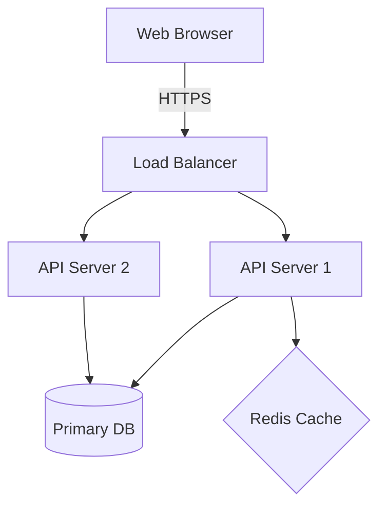

# System Design Document: [Project Name]

> **Instructions:** This is a forward-looking design document. It must be written *before* you write the code for your Capstone project.

## 1. Executive Summary
**Problem Statement:**
*What exact problem does this application solve for the user?*

**Proposed Solution:**
*A brief summary of how the system solves the problem.*

---

## 2. Formal Requirements (EARS)
*List at least 3 core system requirements using the EARS notation.*

1. **[Event-driven]** WHEN... the system SHALL...
2. **[State-driven]** WHILE... the system SHALL...
3. **[Unwanted behavior]** IF... the system SHALL...

---

## 3. Architecture Overview
*Provide a high-level system diagram using `mermaid` syntax.*

---

## 4. API Contract (Core Endpoints)
*Define the 2-3 most critical endpoints your frontend needs from your backend.*

**Endpoint 1:**
- **Method/Path:** `POST /api/v1/orders`
- **Request Payload:** `{ "itemId": 123, "qty": 1 }`
- **Expected Response (Success):** `201 Created`, `{ "orderId": 999, "status": "pending" }`

---

## 5. Security & Isolation Boundaries
*How is this system secured? What is the blast radius if an attacker compromises the web server?*
- (e.g., The web server runs in a distroless Docker container with no root access.)
- (e.g., The database requires SSL connections and is not exposed to the public internet.)

---

## 6. Pre-emptive Architecture Decision Records (ADR)
*Include at least one ADR making a core technical choice. Use the standard format.*

### ADR 001: [Title]
**Context:** [Why is this a hard decision?]
**Decision:** [What are we doing?]
**Consequences:** [What pain are we accepting?]
