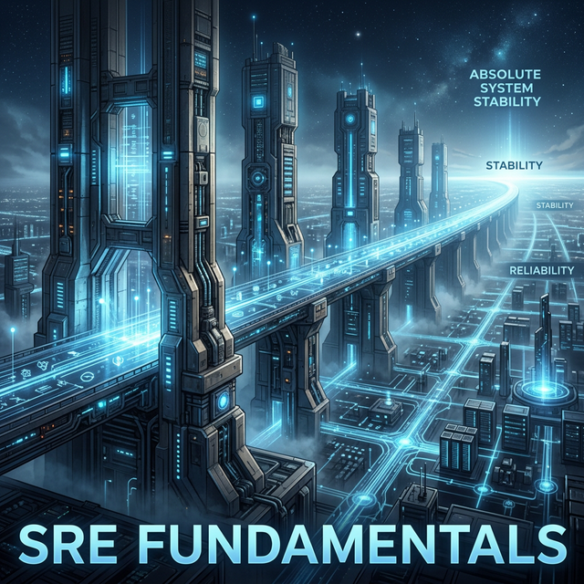

# Module 5: Data, Integration & Reliability
## Day 1: SRE Fundamentals
**Renaissance Developer Academy**

---

# Why Reliability is a Feature

Module 4 asked: *"Is this well-designed?"*
Module 5 asks: *"Will it survive?"*

Reliability is not just keeping things running. It is making a **quantitative promise about service quality** and keeping it.

*If you can't measure it, you can't manage it.*

---

# The SRE Hierarchy

1.  **SLA (Service Level Agreement):** The contractual, legal promise to external users (e.g., 99.9% uptime or we refund you).
2.  **SLO (Service Level Objective):** The internal target for service quality. It must be stricter than the SLA.
3.  **SLI (Service Level Indicator):** The actual metric that measures if you are meeting the SLO.
4.  **Error Budget:** The amount of unreliability allowed before you must prioritize reliability over features.

---

# The Art of Measuring What Matters (SLIs)

*   **Availability:** % of *successful* requests (Not server uptime! The user's experience matters).
*   **Latency:** Response time distribution (p50, p95, p99. *Averages lie.*)
*   **Throughput:** Requests per second at an acceptable latency.
*   **Correctness:** % of responses that are accurate (Crucial for data-intensive apps).
*   **Freshness:** How stale is the data?

---

# Error Budgets: The Ultimate Trade-off

If your SLO is **99.9% availability**, your error budget is **0.1%** of your requests.
*(~43 minutes of downtime allowed per month).*

**The Rule:**
When you burn the budget, you **stop shipping features**. All engineering effort goes into fixing reliability until the budget recovers.

---

# Today's Sprints

1.  **Define:** Set SLOs for your Module 3 Full-Stack Application.
2.  **Instrument:** Implement SLIs (metrics via `/metrics` endpoint or middleware).
3.  **Visualize:** Build a monitoring dashboard for those SLOs.
4.  **Alert:** Define alert rules and thresholds.
