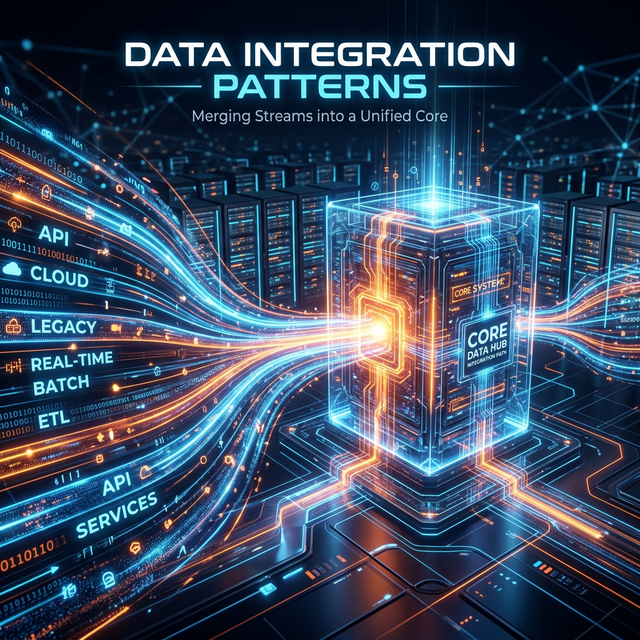

# Module 5: Data, Integration & Reliability
## Day 2: Data Integration Patterns
**Renaissance Developer Academy**

---

# The Three Fundamental Patterns

1.  **API-Based (Synchronous):** Service A calls Service B's API directly.
    *   *Pros:* Simple, immediate response.
    *   *Cons:* Tight coupling, cascading failures, blocks if B is down.
2.  **Event-Driven (Asynchronous):** Service A publishes events, B subscribes.
    *   *Pros:* Loose coupling, resilient, scales naturally.
    *   *Cons:* Eventual consistency, harder to trace and debug.
3.  **ETL/ELT (Batch):** Extract, Transform, Load on a schedule.
    *   *Pros:* Handles massive volumes, source isn't impacted.
    *   *Cons:* Data is always stale (by schedule interval).

---

# The API Gateway Pattern

A single entry point routing requests to appropriate backend services.

**What it handles:**
*   Authentication
*   Rate limiting
*   Request routing
*   Response aggregation

*Trade-off: It massively reduces client-side complexity but introduces a single point of failure. It must be highly available.*

---

# Schema Evolution & Compatibility

In any integration, the producer and consumer will eventually evolve at different speeds.

*   **Forward Compatibility:** New code can read old data.
*   **Backward Compatibility:** Old code can read new data.

If an API changes its JSON payload format, will your pipeline crash?

---

# Today's Sprints

1.  **Design Workshop:** Architect a data integration pattern for a 3-source dashboard. Document your choices through an ADR.
2.  **Pipeline Phase 1:** Build the extraction layer. Implement circuit breakers, timeouts, and rate limits.
3.  **Pipeline Phase 2:** Build the transformation and load layer. Ensure idempotency and write integration tests.
