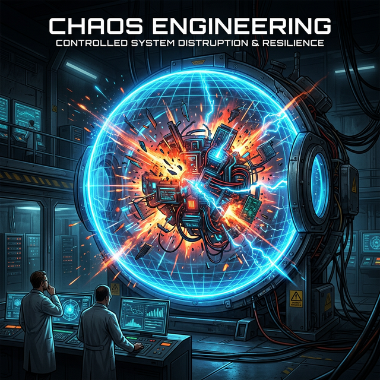

# Module 5: Data, Integration & Reliability
## Day 3: Chaos Engineering
**Renaissance Developer Academy**

---

# Breaking Things on Purpose

*“If you don't test your failure modes, your users will test them for you.”*

Chaos Engineering is the discipline of experimenting on a system in order to build confidence in its capability to withstand turbulent conditions in production.

We do not just cause random damage. We run **scientific experiments**.

---

# The Prerequisites of Chaos

You cannot run chaos experiments if you cannot measure the result.

1.  **Steady State:** You must have metrics (SLIs from Day 1) showing the system is currently healthy.
2.  **Hypothesis:** "When [X] fails, the system will degrade to [Y], but quickly recover."
3.  **Blast Radius:** You must be able to control or limit the damage.
4.  **Abort Condition:** You must know exactly when and how to hit the big red "STOP" button.

---

# What Are We Looking For?

*   **Cascading Failures:** Service A is slow, causing Service B to run out of memory, taking down the entire API.
*   **Retry Storms:** Every client retries a failed request instantly, accidentally DDOSing the server.
*   **Fallback Failures:** The cache goes down, and the database instantly collapses under the read load.
*   **Lack of Graceful Degradation:** A non-critical service (like "recommended items") fails, but crashes the critical service (like "checkout").

---

# The Fallacies of Distributed Computing

When you build distributed systems, do not assume:
1.  The network is reliable.
2.  Latency is zero.
3.  Bandwidth is infinite.
4.  The network is secure.
5.  Topology doesn't change.
6.  There is one administrator.
7.  Transport cost is zero.
8.  The network is homogeneous.

---

# Today's Sprints

1.  **Design:** Formulate 5 chaos experiments for your application.
2.  **Execution (Round 1):** Execute your 3 highest-priority experiments locally. Observe the SLIs. Note the unexpected.
3.  **Remediation:** Implement a fix for the most critical finding using Claude Code CLI.
4.  **Runbook:** Draft an Incident Response Runbook outlining diagnosis and remediation steps for the identified risks.
