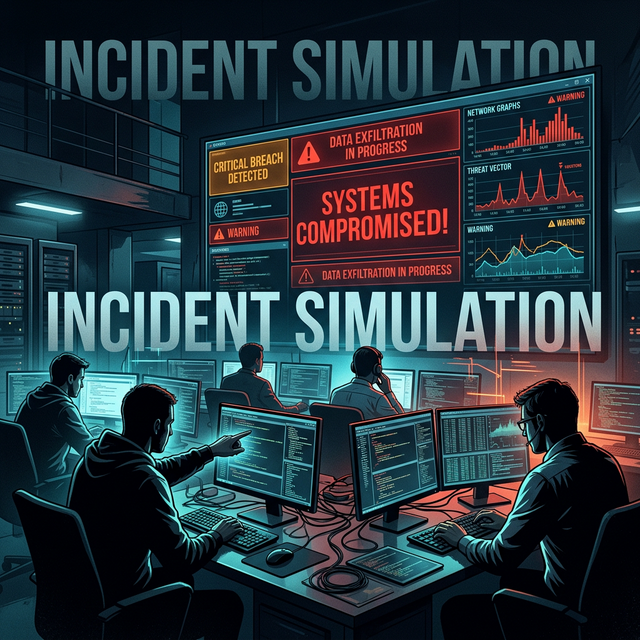

# Module 5: Data, Integration & Reliability
## Day 5: Incident Simulation
**Renaissance Developer Academy**

---

# The Anatomy of an Incident

Incidents in production are rarely caused by a single, massive failure.

They are almost always **a chain of small, interactive failures** that combine to breach the system's defenses.

*Example:* A slow query causes a connection pool to fill up, which memory-starves the API container, which triggers rapid restarts, which DDOSes the database.

---

# The Role of the On-Call Engineer

When the pager goes off, your job is NOT to find the root cause.
Your job is to **mitigate the impact**.

1.  **Acknowledge:** "I am looking into this." (Stops other people from panicking).
2.  **Triage:** How bad is it? Who is affected? Which SLIs are tanking?
3.  **Mitigate:** Stop the bleeding. Scale up the DB, revert the last deploy, block the offending IP address.
4.  **Investigate:** Once the system is stable, *then* you find the root cause.

---

# The Blameless Post-Incident Review (PIR)

You cannot fix a system if engineers are terrified to admit they made a mistake.

**The core assumption of a Blameless PIR:**
*Every engineer did the best they could with the information and tools they had at the time.*

We do not ask: *"Why did John deploy bad code?"*
We ask: *"Why did our CI/CD pipeline allow bad code to be deployed without failing?"*

---

# Today's Sprints

1.  **The Live Incident:** Work in pairs to survive a simulated production failure chain injected by the instructor.
2.  **The Debrief:** Decompress. Which teams mitigated fastest? What tools actually worked?
3.  **The PIR:** Write a formal Post-Incident Review based on the simulation data.
4.  **Module Retrospective:** Reflect on your journey from building (M3/M4) to operating (M5).
