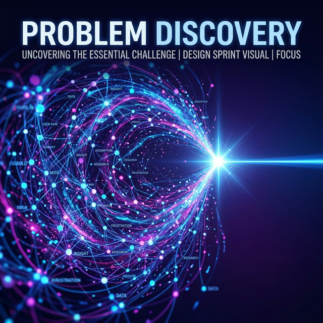

# Module 6: Rapid Prototyping & Design Sprints
## Day 1: Problem Discovery
**Renaissance Developer Academy**

---

# The Shift from Individual to Team

Modules 1-5 taught you how to build, test, and assure reliability natively *as an individual engineer*.

Module 6 shifts the focus. You are no longer coding in isolation.
You are building **software to solve human problems, under immense time pressure, as a cohesive unit.**

---

# What is a Hackathon?

A Hackathon is not just "coding fast for 48 hours."

It is a compression of the entire software development lifecycle into a weekend. 
It tests:
1.  **Prioritization:** Can you cut scope ruthlessly?
2.  **Collaboration:** Can your team merge code without fighting?
3.  **Validation:** Does what you built actually matter to anyone?

---

# The Danger of the "Great Idea"

Most hackathon projects fail because teams fall in love with their *solution* instead of the *problem*.

*   **Bad:** "Let's build an AI chatbot for meeting notes using ClawSwarm!"
*   **Good:** "Engineering managers are drowning in meeting action items and dropping tasks. How do we reduce their cognitive load?"

*Fall in love with the problem. The solution is just a hypothesis.*

---

# Today's Sprints

1.  **Problem Discovery:** Take your assigned ambiguous business challenge. Refine it into a sharp, testable Problem Statement.
2.  **Team Solution Design:** Without talking, individually sketch solutions. Present, merge, and agree on the MVP architecture.
3.  **ClawSwarm Setup:** Prepare your multi-agent architecture to help you build faster tomorrow.
