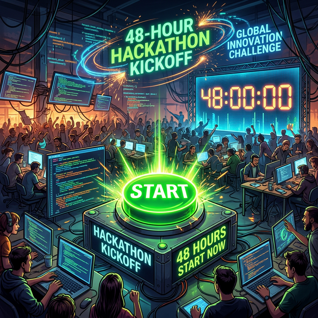

# Module 6: Rapid Prototyping & Design Sprints
## Day 2: 48-Hour Hackathon Kickoff
**Renaissance Developer Academy**

---

# The Rules of Engagement

1.  **Scope is the Enemy:** If a feature does not directly prove or disprove your core hypothesis, CUT IT.
2.  **Mock Before You Build:** Don't spend 6 hours wiring up a real authentication system if hardcoding `user_id = 1` lets you test the actual problem today.
3.  **Deploy Early & Often:** Your CI/CD pipeline should be running by Hour 2. 
4.  **No Solo Heroes:** Use your AI tools, but collaborate on architecture and code review as a team.

---

# The Role of AI in a Hackathon

ClawSwarm is your team's multiplier.

*   *Do not* ask ClawSwarm to "build the app."
*   *Do* ask an Agent to "stub out the database models based on this schema."
*   *Do* ask an Agent to "generate synthetic seed data for our test users."
*   *Do* ask an Agent to "review this PR for edge cases."

Orchestrate the AI; do not abdicate to it.

---

# The 48-Hour Timeline

*   **Hour 0:** Kickoff! (Right now).
*   **Hour 4:** Architecture skeleton committed and CI/CD green.
*   **Hour 24 (Tomorrow Morning):** Core user flow is functional, but ugly.
*   **Hour 36:** Feature cutoff. Polish, seed data, and fix critical bugs.
*   **Hour 48:** Deployment freeze. Demo preparation.

---

# Start Your Engines

Grab your team. Open your GitHub Projects board. Start picking off the tickets from yesterday's Task Breakdown.

The clock starts... **NOW.**
