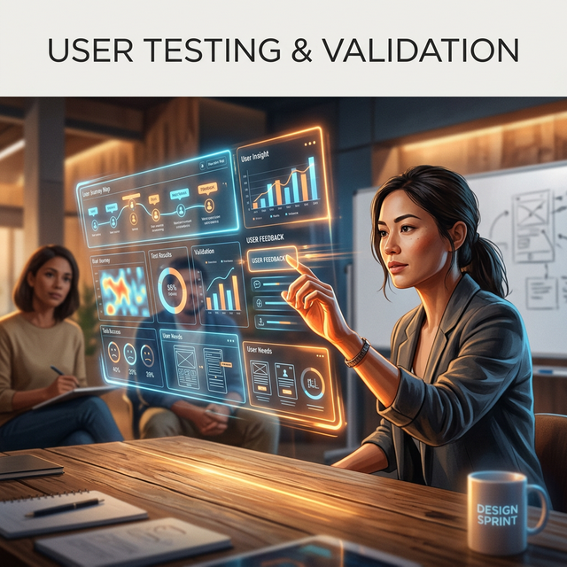

# Module 6: Rapid Prototyping & Design Sprints
## Day 3: User Testing & Validation
**Renaissance Developer Academy**

---

# The Reality Check

Your code compiles. Your CI/CD is green. The backend returns 200 OK.

**But does anyone actually want to use what you built?**

Today, we pause the build. We put the prototype in front of real human beings. We stop talking and start watching.

---

# The Rules of User Testing

This is the hardest part for engineers:
1.  **Do not pitch.** You are not selling the product.
2.  **Do not help.** If they get stuck, let them struggle. Ask: *"What are you trying to do here?"*
3.  **Do not defend.** If they say "This button makes no sense," do not say "Well, the API demanded it." Say "Tell me more about why it's confusing."
4.  **Shut up and watch.**

---

# The Facilitator & The Observer

You must test in pairs.

*   **The Facilitator:** Gives the user scenarios (e.g., "Show me how you would reset your password"). Asks open-ended questions. Manages the human interaction.
*   **The Observer:** Takes furious, literal notes. Records exactly what the user clicks, where they hesitate, and what they say. Does not interrupt.

---

# Synthesis: Making Sense of the Chaos

After 5 interviews, you will have a mountain of messy data.
We use **Affinity Mapping** to synthesize it:

1.  Write every discrete observation on a sticky note.
2.  Group similar notes together on a wall.
3.  Name the groups (e.g., "Navigation Confusion", "Loved the AI Summary").
4.  Prioritize fixes based on these patterns.

---

# Today's Sprints

1.  **Preparation:** Finalize your user testing script and assign roles.
2.  **Execution:** Conduct 3 to 5 live user testing sessions. Read the data.
3.  **Synthesis:** Map your findings. Choose your pivot or persevere strategy.
4.  **Iteration Plan:** Set the backlog for tomorrow's final fix sprint.
