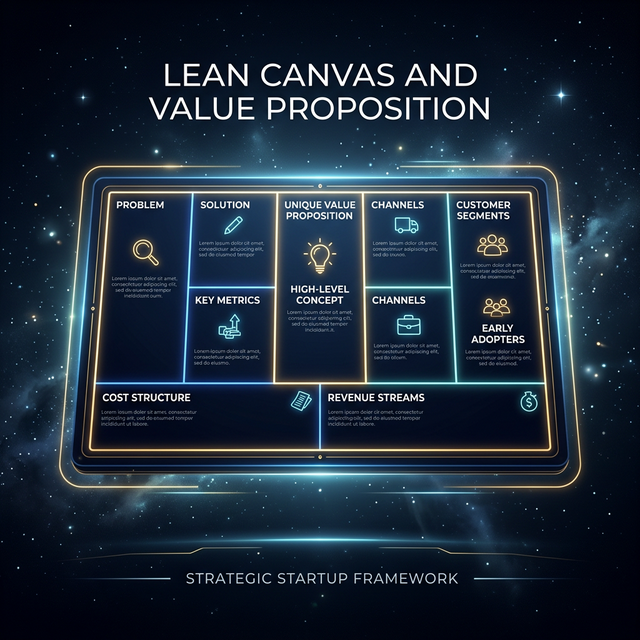

# Module 7: Business Immersion & Product Thinking
## Day 1: Lean Canvas & Value Proposition
**Renaissance Developer Academy**

---

# Why Business Thinking Is Not Optional

Module 6 asked: *"Can you build under pressure?"*
Module 7 asks: *"Should this be built at all?"*

Most technical projects fail not because the code is bad, but because **the problem was wrong.**

The Renaissance Developer speaks two languages: **code** and **business.**

---

# The Lean Canvas: 9 Blocks of Clarity

1.  **Problem:** Top 3 user pains (not features you want to build).
2.  **Customer Segments:** Who, specifically? ("Everyone" is a red flag.)
3.  **Unique Value Proposition (UVP):** One sentence. The hardest block.
4.  **Solution:** The minimum features that address the top problems.
5.  **Unfair Advantage:** What makes this hard to copy?
6.  **Revenue Streams:** How does this make or save money?
7.  **Cost Structure:** What does it cost to build, run, and maintain?
8.  **Key Metrics:** 3–5 numbers that tell you if this is working.
9.  **Channels:** How do users discover and adopt this?

---

# The Value Proposition

**Formula:**
> [Outcome] for [Customer] who [Current Pain], unlike [Alternative], our [Solution] [Key Differentiator].

**Example:**
> *"Faster incident resolution for on-call engineers who waste 30 min finding the right runbook, unlike searching Confluence, our tool surfaces the relevant runbook automatically based on alert context."*

---

# Today's Sprints

1.  **Round 1:** Create Lean Canvases for 2 products you already use (one consumer, one developer tool).
2.  **Round 2:** Create a Lean Canvas for **your capstone project idea**.
3.  **Interview Prep:** Draft your customer discovery interview guide for Day 3.
