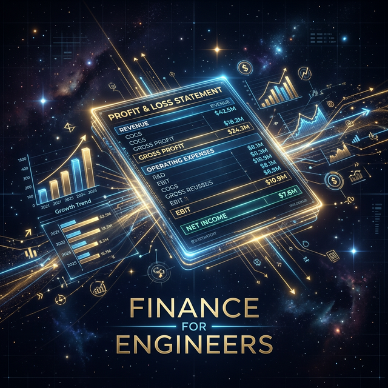

# Module 7: Business Immersion & Product Thinking
## Day 2: Finance for Engineers
**Renaissance Developer Academy**

---

# Learning to Speak Business

Every technical decision you have ever made has had a P&L impact.

*   Choosing a more expensive cloud provider → higher COGS → lower gross margin.
*   Automating a manual process → lower OpEx → higher operating income.
*   Building a feature that reduces churn → improved revenue retention.

Today, we make these connections explicit.

---

# The P&L Statement

| Line Item | What It Means |
|---|---|
| **Revenue** | Money coming in (subscriptions, licenses, services) |
| **COGS** | Direct costs of delivery (hosting, support, licenses) |
| **Gross Margin** | Revenue − COGS. The profit per unit of product. |
| **Operating Expenses** | Salaries, marketing, R&D, office costs |
| **EBITDA** | Gross Margin − OpEx. Are you actually profitable? |
| **Net Income** | The bottom line after taxes and interest |

---

# Unit Economics: The Math of Each Customer

*   **CAC (Customer Acquisition Cost):** How much to get one new customer?
*   **LTV (Lifetime Value):** How much revenue does one customer generate over their lifetime?
*   **The Golden Ratio:** LTV should be at least **3x CAC** for a healthy business.
*   **Payback Period:** How long until CAC is recovered?

---

# Today's Sprints

1.  **P&L Analysis:** Read and analyze 2 simplified P&L statements from fictional companies.
2.  **ROI Calculation:** Calculate the business impact of automating a manual process.
3.  **Metrics Framework:** Define the primary metric, leading indicators, and guardrails for your capstone.
4.  **Industry Analysis:** Use NotebookLM Deep Research to analyze your capstone's competitive landscape.
