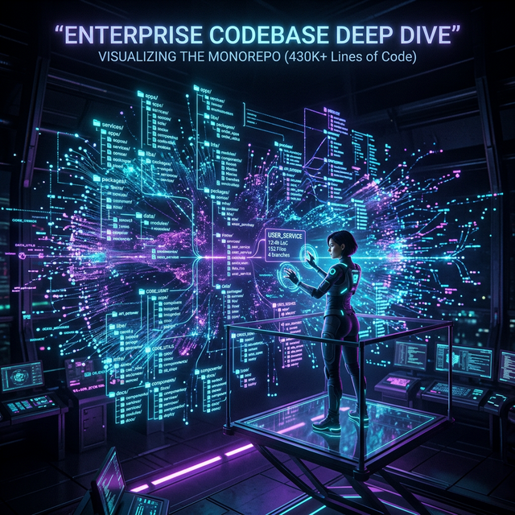

# Module 8: Communication, Leadership & Enterprise Scale
## Day 2: OpenClaw Enterprise Codebase Deep Dive
**Renaissance Developer Academy**

---

# Why Enterprise Codebases Are Different

You've built apps with hundreds of files. OpenClaw has **430,000+ lines** across CLI, Gateway, Agent Runtime, Plugin System, and Infrastructure.

Enterprise code navigation requires a different skill:
- You **can't** read every file.
- You **must** trace specific paths through the architecture.
- AI helps you search, but you **verify** every answer.

---

# The OpenClaw Architecture

| Component | Responsibility |
|---|---|
| **CLI** | Command-line interface for user interaction |
| **Gateway** | HTTP/WebSocket routing to agents |
| **Agent Runtime** | Core execution engine (tools, memory, messaging) |
| **Plugin System** | ClawHub skill marketplace with security boundaries |
| **Infrastructure** | Docker orchestration, logging, monitoring |

---

# How to Read Enterprise Code

1.  **Start from the edges.** Trace a CLI command inward.
2.  **Follow the data.** What happens to a user message?
3.  **Map the patterns.** Middleware chains? Event-driven? Plugin dispatch?
4.  **Ask AI, then verify.** Claude Code can search. You confirm by reading code.

---

# Today's Sprints

1.  **Architecture Treasure Hunt:** Trace 5 critical code paths through the monorepo.
2.  **Architecture Analysis Document:** Write a comprehensive analysis (components, communication, data flow, scalability).
3.  **Show & Tell:** Present your most surprising architectural finding.
