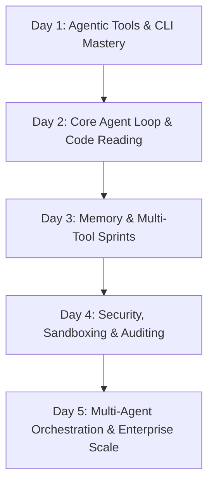

# Proposal: 5-Day Agent Development Course

This document proposes a cohesive 5-day course curriculum on **Agent Development** by adapting slide decks, exercises, and labs from the [Renaissance Developer Academy](file:///Users/sheng/Developer/Renaissance/README.md) repository.

---

## Curriculum Overview

The 5-day course progresses from foundational AI tools and command-line interactions to building, securing, and orchestrating complex autonomous agent architectures.

---

## Daily Course Breakdown

### 🎯 Day 1: Foundational AI Tools & Interactive Code Generation
*   **Goal:** Bridge the gap between static LLM interactions and interactive, agentic coding environments. Learn structured prompt practices necessary for managing AI outputs.
*   **Topics:**
    *   The "AI Multiplier Model" and the Human Quality Gate.
    *   Anatomy of structured prompt layers (Context, Task, Constraints, Output Format, Verification Hooks).
    *   Introduction to developer agent CLI tools (Claude Code, Antigravity, Kiro).
*   **Adapted Slides:**
    *   [AI Tool Mastery Slides](file:///Users/sheng/Developer/Renaissance/module-1/Day-2-AI-Tool-Mastery/01_AI_Mastery_Slides.md)
    *   [Prompt Engineering Slides](file:///Users/sheng/Developer/Renaissance/module-2/Day-1-Prompt-Engineering/01_Prompt_Engineering_Slides.md)
*   **Labs & Exercises:**
    *   [Rosetta Stone Exercise](file:///Users/sheng/Developer/Renaissance/module-1/Day-2-AI-Tool-Mastery/05_Exercise_Rosetta_Stone.md): Compare standard coding workflows vs. interactive, agentic code writing.
    *   [Prompt Playbook Lab](file:///Users/sheng/Developer/Renaissance/module-2/Day-1-Prompt-Engineering/02_Workshop_Prompt_Playbook.md): Construct systematic patterns for scaffolding, refactoring, and debugging.

---

### 🧠 Day 2: Core Agent Loops & Single Agent Architecture
*   **Goal:** Understand what separates a basic coding assistant from an autonomous agent. Read, trace, and extend the core control loop of a real python agent framework.
*   **Topics:**
    *   Defining autonomy, persistence, and external service integrations.
    *   The Agent loop pattern: `Message -> Prompt/LLM -> Tool Extraction -> Execution -> Loop`.
    *   Trace pathways through a ~4,000 line Python agent framework (`Nanobot`).
*   **Adapted Slides:**
    *   [Agent Architecture Slides](file:///Users/sheng/Developer/Renaissance/module-1/Day-3-Agent-Architecture/01_Agent_Architecture_Slides.md)
*   **Labs & Exercises:**
    *   [Nanobot Deep Dive](file:///Users/sheng/Developer/Renaissance/module-1/Day-3-Agent-Architecture/02_Exercise_Nanobot_Deep_Dive.md): Fork, clone, read, and run `Nanobot` locally using APIs or local models (Ollama). Trace where memory, tools, and message cycles are defined.
    *   [Extend Nanobot with Custom Skill](file:///Users/sheng/Developer/Renaissance/module-1/Day-3-Agent-Architecture/03_Exercise_Extend_Nanobot.md): Implement a new skill capability (e.g. GitHub issue summarizer or Markdown-based Study Buddy) and test it.
    *   [CI/CD Agent Lab](file:///Users/sheng/Developer/Renaissance/module-1/Day-3-Agent-Architecture/04_Lab_CICD_Enhancement.md): Configure linting and automated pipeline tests for agent-generated code.

---

### 🛠 Day 3: Advanced Agent Concepts: Tool Routing & Persistent Memory
*   **Goal:** Address key bottlenecks of single-agent environments: tool selection hallucination and context window limits. Add multi-tool support and structured long-term memory.
*   **Topics:**
    *   The Tool Selection Problem and the importance of hyper-specific function descriptions.
    *   Structured memory designs: Short-term (conversation log), Long-term (user profiles, projects), and Episodic (decision log).
    *   Failure modes of agent-generated code (confident hallucinations, stale APIs).
*   **Adapted Slides:**
    *   [Advanced Agents Slides](file:///Users/sheng/Developer/Renaissance/module-2/Day-4-Advanced-Agents/01_Advanced_Agents_Slides.md)
    *   [AI Bug Safari Slides](file:///Users/sheng/Developer/Renaissance/module-2/Day-2-AI-Bug-Safari/01_Bug_Safari_Slides.md)
*   **Labs & Exercises:**
    *   [Multi-Tool Agent Sprint](file:///Users/sheng/Developer/Renaissance/module-2/Day-4-Advanced-Agents/02_Sprint_Multi_Tool.md): Build an agent command center with at least 3 distinct tools (e.g. GitHub client API + web scraper).
    *   [Memory System Integration Sprint](file:///Users/sheng/Developer/Renaissance/module-2/Day-4-Advanced-Agents/03_Sprint_Memory_System.md): Build file-backed profiles (`profile.md`, `corrections.md`) and modify the agent prompt to load/update them across sessions.

---

### 🔒 Day 4: Containerized Agent Security & Sandboxing (Red Teaming)
*   **Goal:** Learn the severe security risks associated with autonomous terminal agents and how to secure them using containerization and sandboxing.
*   **Topics:**
    *   The Principle of Least Privilege in agent execution.
    *   Docker isolation mechanics: volume mounts, network bridges, and non-root execution.
    *   Prompt injections, workspace escapes, and red-teaming methodologies.
*   **Adapted Slides:**
    *   [Agent Security Slides](file:///Users/sheng/Developer/Renaissance/module-4/Day-4-Agent-Security-NanoClaw/01_Agent_Security_Slides.md)
*   **Labs & Exercises:**
    *   [NanoClaw Security Lab](file:///Users/sheng/Developer/Renaissance/module-4/Day-4-Agent-Security-NanoClaw/02_Security_Lab.md): Deploy a secure, containerized variant of the agent framework (`NanoClaw`). Attempt path-traversal attacks and prompt injections to escape the `/workspace` boundary. Compile a security audit report.

---

### 🐝 Day 5: Multi-Agent Swarms & Enterprise Codebase Navigation
*   **Goal:** Scale agent concepts horizontally using multi-agent orchestrations and discover how enterprise teams navigate large codebases with AI support.
*   **Topics:**
    *   Multi-agent orchestration architectures (e.g., Planner-Executor-Reviewer workflows).
    *   Shared memory blackboards (`GOALS.md`, `DECISIONS.md`).
    *   Handling enterprise repositories with gRPC/Docker micro-agents (`ClawSwarm`).
*   **Adapted Slides:**
    *   [ClawSwarm Deep Dive Slides](file:///Users/sheng/Developer/Renaissance/module-6/Day-4-Multi-Agent-Iteration/01_ClawSwarm_Deep_Dive_Slides.md)
    *   [OpenClaw Enterprise Slides](file:///Users/sheng/Developer/Renaissance/module-8/Day-2-OpenClaw-Deep-Dive/01_OpenClaw_Slides.md)
*   **Labs & Exercises:**
    *   [ClawSwarm Multi-Agent Lab](file:///Users/sheng/Developer/Renaissance/module-6/Day-4-Multi-Agent-Iteration/02_ClawSwarm_Guide.md): Configure two specialized agents (Researcher & Engineer) to exchange JSON-structured payloads via Docker Compose to complete a complex task.
    *   [Codebase Navigation Guide](file:///Users/sheng/Developer/Renaissance/module-8/Day-2-OpenClaw-Deep-Dive/02_Codebase_Navigation_Guide.md): Trace data flows and agent commands inward across an enterprise monorepo setting.

---

## Recommendations for Adapting These Materials

1.  **Framework Setup:** Use the existing slides' codebase references (`Nanobot`, `NanoClaw`, `ClawSwarm`, `OpenClaw`) as the unified narrative thread throughout the course. Provide student forks or starter repositories on GitHub beforehand.
2.  **Prerequisites:** Ensure students have basic Python (or Node.js) coding skills, access to a Docker-compliant machine (for Sandboxing labs on Day 4), and API keys (e.g. Gemini, Claude, or local Ollama instances) ready before Day 1.
3.  **Aesthetics & Formatting:** The Marp Markdown files (`.md` slides) in this repo can be compiled directly to `.pptx` or `.html` slide decks for presentation.
